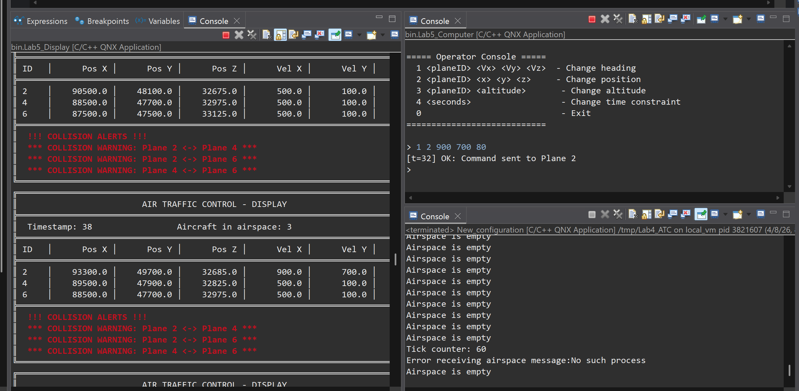
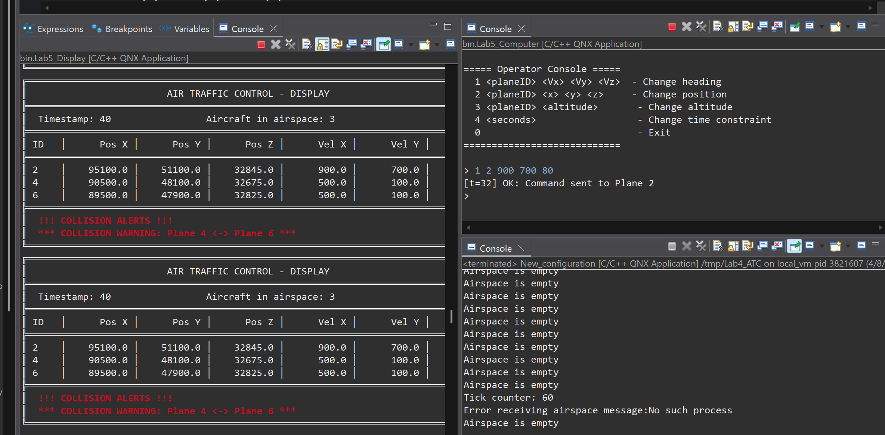
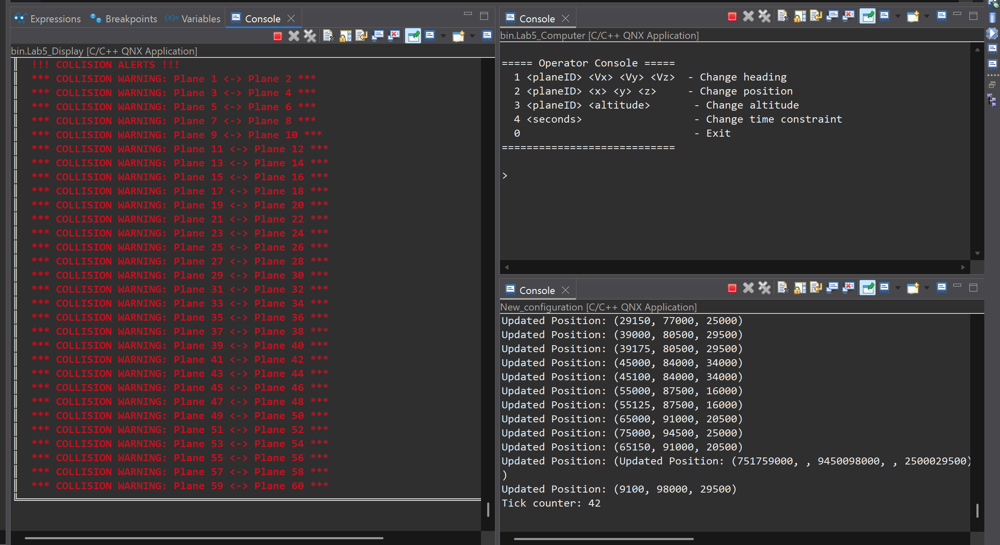

# QNX ATC Realtime System

A simplified en-route Air Traffic Monitoring and Control (ATC) System simulation built in C++ on **QNX Neutrino RTOS**, developed as part of the COEN 320 Real-Time Systems course project at Concordia University.

## Overview

This project simulates an en-route ATC system managing aircraft movement through a 3D airspace (100,000 × 100,000 × 25,000 units, positioned 15,000 ft above sea level). The system tracks aircraft positions in real time, predicts separation violations, issues collision warnings, and supports runtime operator control — all running as concurrent processes on a single-processor QNX target.

---

## System Architecture

The system is split into three QNX processes, each built as a separate project:

| Process | Project | Role |
|---|---|---|
| **ATC** | `ATC/` | Aircraft threads + Radar |
| **Computer** | `Computer/` | ComputerSystem + CommunicationsSystem + OperatorConsole |
| **Display** | `Display/` | Airspace visualization + collision alert receiver |

### Communication flow

```
Aircraft threads ── MsgSend/MsgReply ──> Radar (dipi_radar channel)
                                                  │
                                           writeToSharedMemory()
                                                  │
                                           [/radar_shared_mem]
                                            [/radar_shm_sem]
                                             /            \
                                    ComputerSystem       Display
                                          │                 ▲
                                    collision alert ────────┘
                                          │
                                  CommunicationsSystem
                                          │
                               Aircraft named channel (dipi<ID>)
                                          ▲
                                  OperatorConsole
```

---

## Components

### Aircraft
Each aircraft is an independent thread that enters the airspace at its scheduled time, then continuously updates its own position every second based on its velocity. It listens for incoming requests and responds with its current position and speed when asked by the Radar. It also accepts commands from the operator such as heading, position, or altitude changes and applies them immediately.

### Radar
The Radar is the data collector of the system. It keeps track of which aircraft are currently in the airspace, periodically polls each one to get its latest position and velocity, and writes a fresh snapshot of all aircraft to a shared memory region. This shared snapshot is what the Computer System and Display read from, so the Radar acts as the single source of polling and updating the airspace in real time.

### Computer System
The Computer System reads the shared airspace snapshot every few seconds and checks whether any two aircraft are too close or will become too close within the next 3 minutes (default time constraint) — based on their current positions and velocities. If a potential conflict is detected, it immediately sends a warning to the Display. The operator can also adjust the time constraint collision frequency at runtime to make the system more or less sensitive depending on traffic conditions.

### Communications System
The Communications System acts as the relay between the Operator Console and the aircraft. When the operator issues a command (e.g., change heading), this component receives it and forwards it to the correct aircraft. For augmented info requests, it contacts the aircraft directly and returns the live reply to the operator console without any delay.

### Operator Console
The Operator Console is the controller's interface. It runs as a background thread and accepts typed commands at runtime. The operator can change an aircraft's heading, position, or altitude, request live information regarding any aircraft's current state, or adjust the collision time constraint. Commands are dispatched immediately while the rest of the simulation continues running.

### Display
The Display periodically reads the shared airspace state and prints a formatted table showing every aircraft's current ID, position, and velocity. It also listens for collision warnings sent by the Computer System and prints them as highlighted alerts. Two threads run inside the Display — one for rendering the table, one for receiving warnings, and a mutex keeps them from interfering with each other.

---

## Operator Console Commands

```
1 <planeID> <Vx> <Vy> <Vz>     - Change heading (velocity components)
2 <planeID> <x> <y> <z>        - Change position
3 <planeID> <altitude>         - Change altitude
4 <planeID>                    - Request augmented info (live position + velocity via IPC)
5 <seconds>                    - Change collision time constraint
0                              - Exit console
```

Command `4` sends a live request directly to the target aircraft and prints the reply immediately:

```
> 4 2
[t=42] Augmented info - Plane 2
  Position: (93300.0, 49700.0, 32685.0)
  Velocity: (900.0, 700.0, 0.0)
```

If the aircraft is not in the airspace or its channel is unreachable:

```
No augmented data for plane 2 : not in airspace or channel unavailable.
```

---

## Message Types

Defined in `Msg_structs.h`:

| Message Type | Description |
|---|---|
| `ENTER_AIRSPACE` | Aircraft notifies Radar on entry |
| `EXIT_AIRSPACE` | Aircraft notifies Radar on exit |
| `REQUEST_POSITION` | Radar polls an aircraft |
| `REQUEST_AUGMENTED_INFO` | Operator requests live plane data |
| `REQUEST_CHANGE_OF_HEADING` | Operator changes aircraft velocity |
| `REQUEST_CHANGE_POSITION` | Operator changes aircraft position |
| `REQUEST_CHANGE_ALTITUDE` | Operator changes aircraft altitude |
| `CHANGE_TIME_CONSTRAINT_COLLISIONS` | Operator updates collision time constraint |
| `COLLISION_DETECTED` | ComputerSystem alerts Display |
| `EXIT` | Shutdown signal |

---

## Concurrency & Synchronization

### Threads
Each aircraft runs as an independent `std::thread`. The Radar, ComputerSystem, CommunicationsSystem, Display, and OperatorConsole each spawn their own dedicated threads as well, allowing all subsystems to run concurrently.

### QNX Message Passing (IPC)
All inter-process and inter-thread communication is done through QNX Neutrino's native message passing API:

- `ChannelCreate()` — creates a receive endpoint; used by Radar, CommunicationsSystem, ComputerSystem, and Display to set up their server channels
- `name_attach()` — registers a named channel in the QNX namespace (e.g., `dipi_radar`, `dipi<ID>`) so other processes can look it up by name
- `name_open()` — opens a connection to a named channel; used by aircraft to connect to Radar, and by CommunicationsSystem to connect to individual aircraft
- `ConnectAttach()` — attaches to a channel by channel ID (used within the same process, e.g., OperatorConsole connecting to CommunicationsSystem)
- `MsgSend()` — sends a message and blocks until a reply is received (synchronous)
- `MsgReceive()` — blocks waiting for an incoming message on a channel
- `MsgReply()` — sends the reply to unblock the sender
- `ConnectDetach()` / `name_close()` / `ChannelDestroy()` — clean up connections and channels on shutdown

### Shared Memory
The Radar writes the latest aircraft snapshot to `/radar_shared_mem` (a `SharedMemory` struct holding up to 100 `msg_plane_info` entries) using `shm_open`, `ftruncate`, and `mmap`. The ComputerSystem and Display map the same region read-only. A named POSIX semaphore `/radar_shm_sem` coordinates access across all three processes, preventing the ComputerSystem or Display from reading a partially written snapshot.

### Mutexes
`std::mutex` with `std::lock_guard` is used for intra-process thread safety:

- `airspaceMutex` — protects the active aircraft set in Radar during add, remove, and polling operations
- `bufferSwitchMutex` — protects the double-buffer swap and shared memory write in Radar
- `collision_mutex` — protects the collision warning list in Display, where one thread receives new alerts while another renders them to the console

---

## Project Structure

```
ATC/
└── src/
    ├── main.cpp                   # Entry point, reads input file, starts ATC + Radar
    ├── AirTrafficControl.cpp/h    # Manages aircraft lifecycle
    ├── Aircraft.cpp/h             # Aircraft thread logic, IPC server
    ├── Radar.cpp/h                # Radar polling, shared memory producer
    ├── ATCTimer.cpp/h             # Periodic timer utility
    ├── Msg_structs.h              # Shared message types and structs
    ├── planes.txt                 # Sample input file (6 aircraft)
    └── 100_planes.txt             # Max-load input file (100 aircraft)

Computer/
└── src/
    ├── main.cpp                   # Entry point, starts all Computer subsystems
    ├── ComputerSystem.cpp/h       # Collision detection, shared memory consumer
    ├── CommunicationsSystem.cpp/h # Routes commands to aircraft, handles augmented info
    ├── OperatorConsole.cpp/h      # Runtime operator interface
    ├── ATCTimer.cpp/h
    └── Msg_structs.h

Display/
└── src/
    ├── main.cpp                   # Entry point, starts Display
    ├── Display.cpp/h              # Shared memory consumer, collision IPC server
    ├── ATCTimer.cpp/h
    └── Msg_structs.h
```

---

## Input File Format

Each line defines one aircraft:

```
<time> <ID> <X> <Y> <Z> <SpeedX> <SpeedY> <SpeedZ>
```

**Example (`ATC/src/planes.txt`):**
```
0 1 95750 59850 29950 250 150 50
5 2 75000 45000 35000 500 100 -75
3 3 95750 59850 29950 250 150 50
```

- `time` — simulation second at which the aircraft enters the airspace
- `ID` — unique aircraft identifier
- `X, Y, Z` — entry coordinates
- `SpeedX, SpeedY, SpeedZ` — velocity components (units/second)

---

## Build & Run

### Requirements

- QNX Software Development Platform 7.0+ (recommended: 7.1)
- QNX Momentics IDE
- QNX Neutrino target: Raspberry Pi 4 (`aarch64`) or x86 Virtual Machine (e.g. VBox, VMware)

### Steps

1. Open QNX Momentics and create a new workspace.
2. Import the `ATC`, `Computer`, and `Display` projects.
3. Set target architecture in each project's MakeFile:
   - `aarch64` — Raspberry Pi
   - `x86` — virtual machines
4. Build all three projects.
5. Set up the input file on the QNX target:
   - In Momentics, go to **QNX → Window → Show View → Target File System Navigator**
   - Expand your target (e.g., `local_vm`) and navigate to `/tmp/`
   - Double-click the `/tmp/` folder and create or edit `planes.txt` with your aircraft data (see [Input File Format](#input-file-format))
6. Launch the processes **in this order**:
   1. **ATC** — creates the Radar channel and shared memory that the other processes depend on
   2. **Computer** — starts ComputerSystem, CommunicationsSystem, and OperatorConsole
   3. **Display** — connects to shared memory and starts listening for collision alerts

> **Shared hardware note:** If running on shared QNX machines (e.g., GCS lab), rename shared resources to avoid conflicts with other groups:
> - Shared memory: `/radar_shared_mem_<group>`
> - Semaphore: `/radar_shm_sem_<group>`
> - Aircraft channels: `<group><ID>`

---

## Results

### Operator command and velocity update — 6 aircraft

The operator issued a heading change command (`1 2 900 700 80`) through the Operator Console targeting Plane 2. The Display confirms the velocity updated from (500.0, 100.0) to (900.0, 700.0) in the next render cycle, demonstrating that the full IPC path from OperatorConsole → CommunicationsSystem → Aircraft → Radar → shared memory → Display is working correctly end to end.



### Collision prevention after operator intervention — 6 aircraft

Before the heading change, the Computer System reported three collision warnings: Plane 2 ↔ Plane 4, Plane 2 ↔ Plane 6, and Plane 4 ↔ Plane 6. After Plane 2's new heading took effect, the warnings for Plane 2 were cleared — only the Plane 4 ↔ Plane 6 conflict remained. This confirms that the collision detection reacts correctly to runtime trajectory changes.



### Maximum load — 100 aircraft

Stress test using a 100-plane input file. The system successfully tracked 69 concurrent aircraft and generated collision warnings for all predicted separation violations simultaneously, with the Radar, ComputerSystem, and Display pipeline remaining fully functional throughout.



---

## Author

**Dipita Sinha**  
Concordia University — Gina Cody School of Engineering and Computer Science  
COEN 320 — Introduction to Real-Time Systems

---

## License

Developed for academic purposes. Not licensed for commercial use.
